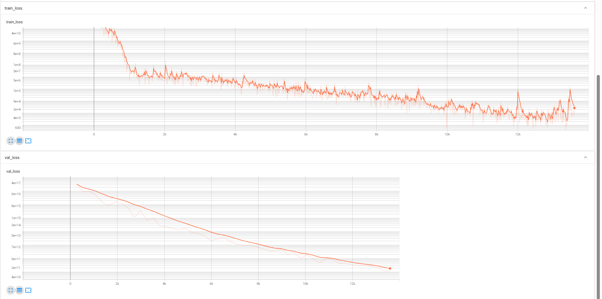

# 氧化物载体表面负载金属团簇生成模型 — 进度报告

## 背景

基于 arXiv:2402.17404v2 的模型[nronne/dss: Diffusion Structure Search](https://github.com/nronne/dss)

## 主要改动

### 1. 掩码策略改进

原框架按照 $z \le h$ 判定基底原子，我这里直接按照元素种类掩码

### 2. 去除 z 方向约束

原框架将扩散限制在 $z \in [2.5, 7.8]$ Å 的 slab 内。本工作去除该约束，金属在 3D 空间自由扩散，更适用于团簇。

### 3. 原子物理、化学特征注入

目前，在 score 模型的标量表示层拼接了**5 个原子特征**：

1. 电负性
2. 原子半径
3. 族
4. 周期
5. 原子质量

## 初步训练结果

- 当前数据：`AuNiCuPdPt-ZnO.arc`
- 50 epoch 初步训练
- 模型参数量：~235K、

下图 $y$ 轴进行了 $log\ scale$ 处理

## 后续拓展方向

### 更多物理化学特征

1. 电离能
2. 金属金属相互作用，金属氧相互作用

等等。

